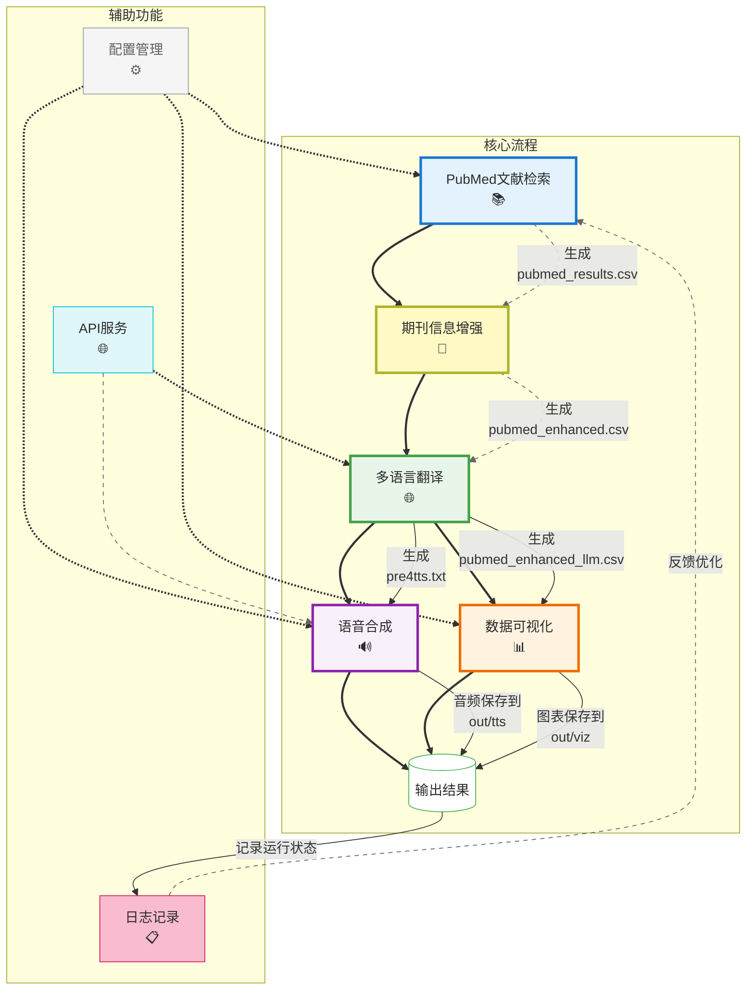

# PubMed文献一站式处理系统

一个用于自动化PubMed文献检索、处理、翻译和语音合成的集成工具。

## 一、项目简介

该系统实现了从PubMed检索文献到生成语音合成的全流程自动化处理，主要包括以下功能：

1. **文献检索**：根据关键词从PubMed获取最新文献
2. **期刊信息增强**：为文献添加期刊影响因子、分区等信息
3. **文献翻译**：调用AI将英文文献的标题、关键词和摘要翻译成中文
4. **语音合成**：将翻译后的内容转换为语音文件
5. **数据可视化**：生成期刊影响因子、分区分布等图表



## 二、系统要求

- Python 3.7+（本人用的是3.12）
- 需要安装的第三方库（可通过`pip install -r requirements.txt`安装）:
  - openai
  - dashscope
  - biopython
  - tqdm
  - python-dotenv
  - tiktoken
  - matplotlib
  - numpy
  - seaborn（可选）

## 三、快速开始

1. **获取代码**
   - 下载本项目的ZIP压缩包并解压
   - 或使用Git克隆:
     ```bash
     git clone https://github.com/xtbggqy/pub2tts.git
     cd pub2tts
     ```

2. **安装依赖**
   ```bash
   pip install -r requirements.txt
   ```

3. **配置参数**
   - 打开`pub.txt`文件进行配置
   - 必须配置的项目:
     - `api_key`: 阿里云通义千问API密钥 (从[阿里云百炼平台](https://bailian.console.aliyun.com/)获取)
     - `query`: PubMed搜索关键词 (如"cancer therapy")
   - 可选配置:
     - `max_results`: 检索文献数量 (默认30篇)
     - `time_period`: 文献发表时间范围 (默认2年内)
     - `max_articles`: 需要翻译的文章数 (默认3篇)

4. **运行程序**
   ```bash
   python main.py
   ```
   - 使用`-v`参数可查看详细日志: `python main.py -v`
   - 使用`-s`参数可执行一个或多个步骤:
     ```bash
     # 单个步骤
     python main.py -s search
     
     # 多个步骤（按照顺序执行）
     python main.py -s search enhance
     
     # 跳过语音合成步骤
     python main.py --no-tts
     
     # 仅执行可视化步骤
     python main.py -s viz
     
     # 快速命令，仅执行可视化功能
     python main.py --viz-only
     ```

5. **查看结果**
   - 所有输出文件保存在`out`文件夹
   - 处理3篇文献全流程约需2-3分钟 (夜间API调用较少时约1分钟)
   - 生成的音频文件位于`out`文件夹中
   - 可视化图表保存在`out/viz`文件夹中

6. **关于API成本**
   - 处理3篇文献的成本估算: 约0.14元人民币（查找文献完全免费）
   - 阿里云API每月有免费额度:
     - 通义千问LLM: 每月免费额度视账号类型而定（经常会有一些免费的大模型可供使用）
     - TTS语音合成: 每月前3万字符免费
   - 在免费额度内基本不产生费用
   - [阿里云学生优惠](https://university.aliyun.com/)（包括本科生和研究生），每年免费领300元优惠券

## 四、配置文件

系统通过`pub.txt`文件进行配置，主要参数包括：

### 基础配置
- `query`：PubMed搜索关键词，支持高级检索语法
- `start_date`/`end_date`：文献检索日期范围
- `time_period`：最近时期（年），如0.5表示最近6个月
- `max_results`：最大检索结果数量
- `get_citations`：是否获取引用数量(yes/no)

### 文件路径配置
- `input_sort`：期刊增强输入文件路径
- `output_sort`：期刊增强输出文件路径
- `input_llm`：翻译输入文件路径
- `output_llm`：翻译输出CSV文件路径
- `output_llm2`：翻译输出TXT文件路径（用于TTS）
- `journal_data_path`：期刊信息数据文件路径

### AI和语音配置
- `api_key`：通义千问API密钥
- `api_base_url`：API基础URL
- `ai_model`：AI模型名称
- `max_articles`：翻译处理的最大文章数
- `tts_model`：语音合成模型/音色
- `tts_format`：音频输出格式(mp3/wav)
- `tts_output_dir`：语音输出目录

### 可视化配置
- `viz_enabled`：是否启用可视化功能(yes/no)
- `viz_output_dir`：可视化图表输出目录
- `viz_format`：图表格式(png/jpg/pdf/svg)
- `viz_style`：图表样式(ggplot/seaborn/classic等)
- `viz_dpi`：图表分辨率
- `viz_figsize`：图表尺寸(宽度,高度)
- `viz_show_if`：是否显示影响因子趋势(yes/no)
- `viz_show_quartile`：是否显示分区分布(yes/no)
- `viz_show_journals`：是否显示期刊分布(yes/no)
- `viz_show_years`：是否显示发表年份分布(yes/no)
- `viz_color_theme`：颜色主题(default/modern/pastel/dark/scientific)
- `viz_font_size`：图表字体大小
- `viz_title_size`：图表标题字体大小
- `viz_label_size`：图表标签字体大小
- `viz_grid_alpha`：网格透明度(0-1)

### TTS内容选择功能

系统支持自定义选择要转换为语音的内容部分：

1. 在`pub.txt`配置文件中设置`tts_content`参数：
   ```
   # TTS内容选择（用逗号分隔，可多选）
   tts_content=title_zh,abstract_zh,authors
   ```

2. 可选的内容组件：
   - `title_zh`: 翻译后的中文标题
   - `title_en`: 原始英文标题
   - `keywords_zh`: 翻译后的中文关键词
   - `keywords_en`: 原始英文关键词
   - `abstract_zh`: 翻译后的中文摘要
   - `abstract_en`: 原始英文摘要
   - `authors`: 作者名单
   - `journal`: 期刊名称（含影响因子和分区信息）
   - `impact_factor`: 单独添加影响因子信息
   - `quartile`: 单独添加分区信息
   
3. 预设组合（快捷选项）：
   - `all_zh`: 所有中文内容（标题、关键词、摘要）
   - `all_en`: 所有英文内容（标题、关键词、摘要）
   - `mixed`: 优先使用中文，如某部分无中文翻译则使用英文
   - `journal_full`: 包含期刊名称、影响因子和分区信息

4. 使用效果：
   - 纯内容输出：选择`tts_content=journal,title_zh`时，输出不包含"期刊："、"标题："等前缀标签
   - 简洁输出：语音文件中只包含所选内容，避免不必要的信息

5. 示例配置：
   - 仅合成中文标题和摘要：`tts_content=title_zh,abstract_zh`
   - 中英文标题都合成：`tts_content=title_zh,title_en`
   - 仅合成期刊名称和中文标题：`tts_content=journal,title_zh`
   - 合成完整文献信息：`tts_content=title_zh,keywords_zh,abstract_zh,authors,journal`

该功能使您可以根据需求灵活选择要转换为语音的内容组合，既可以减少不必要的语音合成时间，也能根据不同场景定制语音内容。输出内容不包含任何标签（如"标题："），使语音输出更加自然流畅。

## 五、组件说明

### main.py

主程序，协调调用各个模块，提供完整流程和单步执行选项。

**用法**:
```bash
# 执行完整流程
python main.py

# 执行特定步骤（可以同时执行多个步骤），前提是你准备需要的文件和参数
python main.py -s search                   # 仅执行文献检索
python main.py -s search enhance           # 执行检索和增强
python main.py -s enhance translate tts    # 执行增强、翻译和语音合成
python main.py --no-tts                    # 执行前三个步骤，跳过语音合成
python main.py -s viz                      # 仅执行可视化
python main.py --viz-only                  # 仅执行可视化功能(简化命令)

# 使用特定配置文件，默认配置文件为`pub.txt`
python main.py -c custom_config.txt
```

### pub_search.py

PubMed文献检索模块，从PubMed API获取文献信息。

**独立使用**:
```bash
python pub_search.py
```

### journal_enhancement.py

期刊信息增强模块，根据期刊名称添加影响因子、分区等信息。

**独立使用**:
```bash
python journal_enhancement.py
```

### llm_understand.py

文献翻译和理解模块，使用AI对标题、关键词和摘要进行翻译，翻译进行两轮以保证其准确性。

**独立使用**:
```bash
python llm_understand.py
```

### ali2tts_ai.py

语音合成模块，将翻译后的文本转换为语音文件。

**独立使用**:
```bash
python ali2tts_ai.py
```

### journal_viz.py

期刊数据可视化模块，提供将期刊影响因子和分区信息可视化的功能。

**独立使用**:
```bash
python journal_viz.py
```
**生成图表**:
- 影响因子趋势图 - 展示检索文献的期刊影响因子分布
- 分区分布饼图 - 展示检索文献的期刊分区分布
- 期刊分布图 - 展示检索文献中最常出现的期刊
- 发表年份分布图 - 展示检索文献的发表时间分布

## 六、工作流程

1. **文献检索**：`pub_search.py`
   - 从PubMed检索符合条件的文献
   - 输出到`pubmed_results.csv`

2. **期刊信息增强**：`journal_enhancement.py`
   - 读取`pubmed_results.csv`
   - 添加期刊影响因子和分区信息
   - 输出到`pubmed_enhanced.csv`

3. **文献翻译**：`llm_understand.py`
   - 读取`pubmed_enhanced.csv`
   - 翻译标题、关键词和摘要
   - 输出所有翻译结果到`pubmed_enhanced_llm.csv`
   - 输出用于TTS的结构化数据到`pre4tts.txt`

4. **语音合成**：`ali2tts_ai.py`
   - 读取`pre4tts.txt`中的结构化数据
   - 根据配置文件中的`tts_content`设置提取所需内容
   - 生成语音文件并保存到输出目录

5. **数据可视化**：`journal_viz.py`
   - 读取`pubmed_enhanced.csv`
   - 根据配置文件中的`viz_*`设置生成图表
   - 输出图表到指定目录

## 七、高级用法

### 自定义期刊信息数据

系统使用JSON格式的期刊数据文件来获取期刊的影响因子和分区信息。您可以通过修改`journal_data_path`指向自己的数据文件。

默认的期刊数据格式示例：
```json
{
  "Nature": {
    "rank": {
      "sciif": "49.962",
      "sci": "Q1"
    }
  }
}
```

您可以从Zotero的样式文件中导出期刊数据，或手动创建符合上述格式的JSON文件。程序会自动匹配期刊名称，即使不完全相同也能进行模糊匹配。

### 排序方式

可在配置文件中设置文章排序方式：
- `impact_factor`: 按影响因子排序(从高到低)
- `journal`: 按期刊名称排序(字母顺序)
- `quartile`: 按分区排序(Q1>Q2>Q3>Q4)
- `date`: 按发表日期排序(从新到旧)

### 语音模型选择

系统默认使用`sambert-zhichu-v1`模型，可以在配置文件中通过`tts_model`参数更改。阿里云提供多种语音模型，您可以访问[阿里云语音合成文档](https://help.aliyun.com/zh/model-studio/user-guide/text-to-speech)查看可用选项。

常用模型包括：
- `sambert-zhichu-v1`: 知厨（男声）
- `sambert-zhizhe-v1`: 知哲（男声） 
- `sambert-zhiying-v1`: 知颖（女声）
- `sambert-zhitian-v1`: 知甜（女声）

### 搜索词增强机制

系统搜索词润色功能采用了双轮优化策略：

1. **第一轮转换**：将简单关键词转换为PubMed高级检索格式
   - 分析核心概念，寻找MeSH主题词和相关同义词
   - 添加合适的字段限定词和布尔运算符
   - 构建初步的检索式

2. **第二轮校正**：对第一轮结果进行优化和简化
   - 确保检索式简洁有效，术语数量控制在5个以内
   - 优先使用通用字段如`[All Fields]`和`[MeSH Terms]`
   - 修复语法错误和格式问题

3. **安全机制**：
   - 对常见基础关键词（如plant、genome等）使用预设的简单检索式，避免过度复杂化
   - 当检索式缺少必要字段时，自动添加全局字段确保检索有效
   - 处理失败时返回安全的基本检索式

这种多轮优化策略确保了搜索词的准确性和简洁性，特别适合复杂学术检索和基础关键词检索。

### 数据流优化

系统数据流处理逻辑优化：

1. **结构化数据传递**：
   - `pre4tts.txt`文件使用JSON结构保存文章数据
   - 通过`@@DATA_BEGIN@@`和`@@DATA_END@@`标记包围JSON数据
   - TTS组件根据用户配置智能提取需要的内容部分

2. **输出文件分离**：
   - `pubmed_enhanced_llm.csv`：保存完整的翻译结果，包含原文和译文
   - `pre4tts.txt`：仅包含TTS所需的结构化数据
   - `out/pub4tts.txt`：用`--pure-text`选项生成的纯文本内容文件

3. **内存效率**：
   - 数据处理采用流式处理，减少内存占用
   - 大型CSV文件处理采用分批读取和处理策略

### 期刊数据可视化功能

系统提供丰富的期刊数据可视化功能，可以直观地了解文献的期刊影响因子、分区分布等信息：

1. **影响因子趋势图**：
   - 展示检索到的文章中各期刊的影响因子分布
   - 使用美观的渐变色条形图显示
   - 包含精确数值标签和清晰排版

2. **分区分布饼图**：
   - 直观展示Q1/Q2/Q3/Q4各分区占比
   - 使用专业配色方案，视觉效果更佳
   - 同时显示数量和百分比标签

3. **期刊分布图**：
   - 使用彩色条形图展示最常出现的期刊
   - 自动处理过长的期刊名称，保持清晰可读
   - 显示精确的文章数量

4. **发表年份分布图**：
   - 使用渐变色折线图展示文章发表趋势
   - 数据点标注清晰的数量值
   - 自动优化年份范围显示

5. **自定义颜色主题**：
   - 五种专业颜色主题可选: default、modern、pastel、dark、scientific
   - 每种主题包含协调的配色方案，适合不同场合和个人喜好
   - 在pub.txt中通过`viz_color_theme`参数设置

6. **高级定制选项**：
   - 可自定义字体大小、网格样式、图表尺寸等
   - 支持多种图片格式输出: PNG, JPG, PDF, SVG
   - 精细控制每个图表元素的显示效果

7. **使用方法**：
   ```bash
   # 在步骤执行后自动生成图表
   python main.py -s search enhance
   
   # 或仅执行可视化步骤
   python main.py -s viz
   
   # 快速命令
   python main.py --viz-only
   
   # 使用特定的颜色主题(需先在pub.txt中设置)
   # viz_color_theme=modern/pastel/dark/scientific
   ```

8. **图表保存位置**：
   - 默认保存在`out/viz`目录
   - 可通过`viz_output_dir`配置自定义保存位置

此功能帮助您直观理解检索到的文献在学术期刊中的分布情况，通过专业的可视化图表辅助科研决策和文献质量评估。

## 八、新增日志功能

系统现在支持同时将日志输出到终端和文件：

1. **默认配置**:
   - 日志文件保存在 `out/pub.log`
   - 日志包含详细的操作记录和错误信息
   - 每次运行会在日志文件中添加新的记录，而不是覆盖

2. **命令行选项**:
   - 使用 `-l, --log` 参数指定自定义日志文件路径：
     ```bash
     python main.py --log my_custom_log.txt
     ```
   - 使用 `--no-log` 参数完全禁用日志文件：
     ```bash
     python main.py --no-log
     ```

3. **日志级别**:
   - 日志文件中包含更详细的信息，包括时间戳和级别
   - 级别包括：INFO, WARNING, ERROR, SUCCESS, DEBUG
   - 使用 `-v, --verbose` 参数可以获取更详细的日志输出

4. **日志查看**:
   - 可以随时查看日志文件来了解过去的运行情况
   - 日志文件可以用任何文本编辑器打开
   - 每次运行会在日志中添加明显的分隔标记

这个功能使系统更容易排错和记录运行历史，特别是对于长时间运行的批处理任务。

## 九、常见问题

1. **找不到期刊信息**
   - **问题**: 系统无法找到某些期刊的影响因子或分区信息
   - **解决方案**:
     - 检查期刊名称是否匹配，尝试使用期刊的完整官方名称
     - 确认`journal_data_path`指向正确的期刊数据文件
     - 手动编辑zoterostyle.json文件，添加缺失的期刊信息
     - 参考示例格式：`{"期刊名称": {"rank": {"sciif": "影响因子", "sci": "分区"}}}`

2. **API调用失败**
   - **问题**: 调用阿里云API时出现错误
   - **解决方案**:
     - 确认API密钥是否正确配置在pub.txt文件中
     - 检查网络连接是否稳定，尝试访问阿里云官网测试连接
     - 查看是否超出API调用限制，可登录阿里云控制台查看
     - 错误信息通常会提供详细原因，根据错误码查阅阿里云文档

3. **翻译质量问题**
   - **问题**: 某些专业术语翻译不准确
   - **解决方案**:
     - 尝试在配置文件中更改为更先进的模型，如`qwen-plus`或`qwen-max`
     - 对于特别专业的领域术语，可以在后期手动修正翻译结果
     - 将`optimize_keywords`设置为`yes`可以改进关键词翻译质量

4. **TTS内容选择问题**
   - **问题**: 使用`tts_content`设置但语音内容不符合预期
   - **解决方案**:
     - 确认配置文件中参数名称和值的正确性，多个值用逗号分隔
     - 使用`-v`参数运行程序，查看详细日志了解内容选择过程
     - 检查`pre4tts.txt`文件内容是否包含JSON数据块
     - 使用`python main.py --pure-text`生成纯文本文件，检查内容

5. **程序运行缓慢**
   - **问题**: 程序运行时间过长
   - **解决方案**:
     - 减少`max_results`和`max_articles`参数值，处理更少的文章
     - 将`get_citations`设置为`no`，跳过引用计数获取步骤
     - 如果只需要检索和增强步骤的结果，使用`python main.py -s search enhance`跳过耗时的翻译和TTS步骤
     - 确保网络连接稳定，使用有线网络可能比无线网络更稳定

6. **文件编码问题**
   - **问题**: CSV文件中出现乱码或特殊字符显示异常
   - **解决方案**:
     - 使用支持UTF-8编码的软件打开CSV文件，如Excel 2019+或LibreOffice
     - 如果使用Excel且版本较旧，先用记事本打开CSV文件，另存为ANSI编码再用Excel打开
     - 程序输出的CSV文件默认使用UTF-8-SIG编码，添加BOM头以兼容Excel

7. **缺少依赖库**
   - **问题**: 运行时报错找不到某些模块
   - **解决方案**:
     - 运行 `pip install -r requirements.txt` 安装所有依赖
     - 如果某些库安装失败，可以单独安装: `pip install 模块名称`
     - 某些系统可能需要管理员权限安装模块: `sudo pip install 模块名称`

8. **API密钥和访问问题**
   - **问题**: 无法正确设置或使用API密钥
   - **解决方案**:
     - 确保密钥格式正确，无多余空格或换行符
     - 可以使用环境变量设置API密钥: 创建`.env`文件并添加`DASHSCOPE_API_KEY=您的密钥`
     - 检查阿里云账户余额是否充足，部分API功能可能需要账户有余额才能使用
     - 如果您是学生，可申请阿里云学生优惠获取免费额度

9. **语音合成音质问题**
   - **问题**: 生成的语音文件音质不佳或不自然
   - **解决方案**:
     - 尝试不同的`tts_model`参数，选择更适合您需求的语音
     - 增加`tts_sample_rate`参数值，如设置为`48000`获取更高质量音频
     - 选择`wav`格式而非`mp3`可以获得无损音质，但文件体积更大
     - 调整文本内容，增加标点符号可以改善语音停顿和语调

10. **默认参数问题**
    - **问题**: 不确定应该如何设置配置参数的最佳值
    - **解决方案**:
      - 可以不指定参数使用系统默认值，这些默认值已经过优化
      - 对于初次使用，建议使用`query="您的主题"`和`max_articles=1`进行测试
      - 通过`-v`参数查看详细日志，了解各参数的影响
      - 可参考示例配置文件作为起点，根据需要调整参数

## 十、许可证

本项目采用MIT许可证
