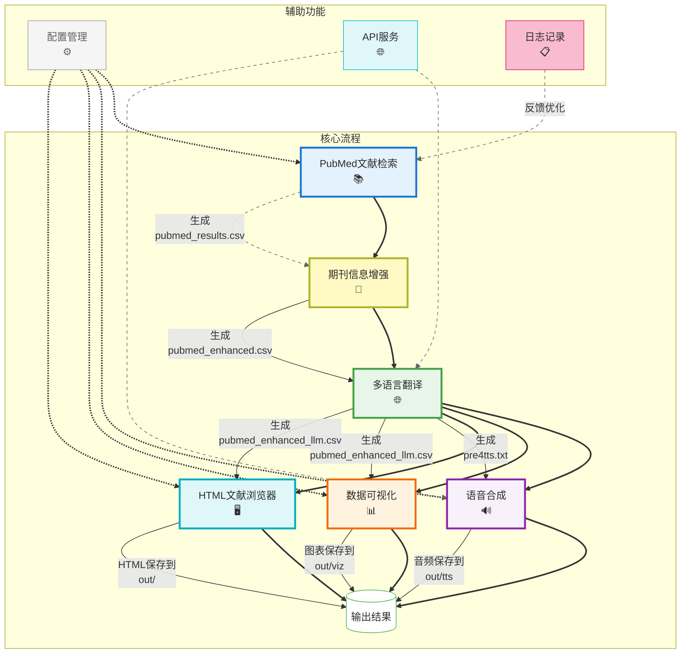

# PubMed文献一站式处理系统

一个用于自动化PubMed文献检索、处理、翻译和语音合成的集成工具。

## 一、项目简介

该系统实现了从PubMed检索文献到生成语音合成的全流程自动化处理，主要包括以下功能：

1. **文献检索**：根据关键词从PubMed获取最新文献
2. **期刊信息增强**：为文献添加期刊影响因子、分区等信息
3. **文献翻译**：调用AI将英文文献的标题、关键词和摘要翻译成中文
4. **语音合成**：将翻译后的内容转换为语音文件
5. **数据可视化**：生成期刊影响因子、分区分布等图表
6. **HTML文献浏览器**：交互式浏览和检索文献



## 二、系统要求

- Python 3.10+
- 必要的第三方库:
  - biopython: PubMed文献检索
  - dashscope/openai: AI翻译接口
  - matplotlib, numpy: 数据可视化
  - tiktoken, tqdm, python-dotenv: 工具支持

可通过以下命令安装所有依赖：
```bash
pip install -r requirements.txt
```

## 三、快速开始

1. **配置参数**
   - 编辑`pub.txt`文件
   - 必填项:
     - `query`: PubMed搜索关键词(如"pangenome")
     - `api_key`: AI API密钥(从[阿里云百炼平台](https://bailian.console.aliyun.com/)获取)

2. **运行程序**
   ```bash
   python main.py
   ```

   常用命令选项：
   ```bash
   # 查看详细日志
   python main.py -v
   
   # 执行特定步骤
   python main.py -s search enhance
   
   # 快速命令，仅执行可视化功能
   python main.py --viz-only
   ```

3. **查看结果**
   - 所有输出文件保存在`out`目录
   - 处理完成后会自动打开HTML文献浏览器

4. **关于API成本**
   - 处理3篇文献的成本估算: 约0.14元人民币（查找文献完全免费）
   - 阿里云API每月有免费额度:
     - 通义千问LLM: 每月免费额度视账号类型而定（经常会有一些免费的大模型可供使用）
     - TTS语音合成: 每月前3万字符免费
   - 在免费额度内基本不产生费用
   - [阿里云学生优惠](https://university.aliyun.com/)（包括本科生和研究生），每年免费领300元优惠券

## 四、配置文件

系统通过`pub.txt`文件进行配置，主要参数包括：

### 基础配置
- `query`：PubMed搜索关键词，支持高级检索语法
- `start_date`/`end_date`：文献检索日期范围
- `time_period`：最近时期（年），如0.5表示最近6个月
- `max_results`：最大检索结果数量
- `get_citations`：是否获取引用数量(yes/no)

### 文件路径配置
- `input_sort`：期刊增强输入文件路径
- `output_sort`：期刊增强输出文件路径
- `input_llm`：翻译输入文件路径
- `output_llm`：翻译输出CSV文件路径
- `journal_data_path`：期刊信息数据文件路径

### AI和语音配置
- `api_key`：通义千问API密钥
- `api_base_url`：API基础URL
- `ai_model`：AI模型名称
- `max_articles`：翻译处理的最大文章数
- `retry_times`：API调用失败重试次数

### HTML浏览器配置
- `generate_html`：是否生成HTML浏览器(yes/no)
- `html_page_title`：HTML页面标题
- `html_default_columns`：默认显示的列
- `html_search_field`：默认搜索字段
- `articles_per_page`：每页显示文章数量
- `html_dark_mode`：是否启用暗色模式
- `html_auto_open`：是否自动打开生成的HTML

### 可视化配置
- `viz_enabled`：是否启用可视化功能(yes/no)
- `viz_output_dir`：可视化图表输出目录
- `viz_format`：图表格式(png/jpg/pdf/svg)
- `viz_style`：图表样式(ggplot/seaborn/classic等)
- `viz_dpi`：图表分辨率
- `viz_figsize`：图表尺寸(宽度,高度)
- `viz_show_if`：是否显示影响因子趋势(yes/no)
- `viz_show_quartile`：是否显示分区分布(yes/no)
- `viz_show_journals`：是否显示期刊分布(yes/no)
- `viz_show_years`：是否显示发表年份分布(yes/no)
- `viz_color_theme`：颜色主题(default/modern/pastel/dark/scientific)
- `viz_wordcloud_max`：词云图最大显示词数

## 五、组件说明

### main.py

主程序，协调调用各个模块，提供完整流程和单步执行选项。

**用法**:
```bash
# 执行完整流程
python main.py

# 执行特定步骤（可以同时执行多个步骤）
python main.py -s search                   # 仅执行文献检索
python main.py -s search enhance           # 执行检索和增强
python main.py -s enhance translate html   # 执行增强、翻译和HTML生成
python main.py -s viz                      # 仅执行可视化
python main.py --viz-only                  # 仅执行可视化功能(简化命令)

# 使用特定配置文件，默认配置文件为`pub.txt`
python main.py -c custom_config.txt
```

### pub_search.py

PubMed文献检索模块，从PubMed API获取文献信息。

### journal_enhancement.py

期刊信息增强模块，根据期刊名称添加影响因子、分区等信息。

### llm_understand.py

文献翻译和理解模块，使用AI对标题、关键词和摘要进行翻译。

### html_viewer_core.py

HTML文献浏览器生成模块，创建交互式文献浏览器。

### journal_viz.py

期刊数据可视化模块，提供将期刊影响因子和分区信息可视化的功能。

## 六、工作流程

1. **文献检索**：`pub_search.py`
   - 从PubMed检索符合条件的文献
   - 输出到`pubmed_results.csv`

2. **期刊信息增强**：`journal_enhancement.py`
   - 读取`pubmed_results.csv`
   - 添加期刊影响因子和分区信息
   - 输出到`pubmed_enhanced.csv`

3. **文献翻译**：`llm_understand.py`
   - 读取`pubmed_enhanced.csv`
   - 翻译标题、关键词和摘要
   - 输出到`pubmed_enhanced_llm.csv`

4. **HTML文献浏览器**：`html_viewer_core.py`
   - 读取`pubmed_enhanced_llm.csv`
   - 生成交互式HTML文件
   - 输出到`out/literature_viewer.html`

5. **数据可视化**：`journal_viz.py`
   - 读取`pubmed_enhanced.csv`
   - 根据配置生成图表
   - 输出图表到`viz_output_dir`目录

## 七、高级用法

### 自定义期刊信息数据

系统使用JSON格式的期刊数据文件来获取期刊的影响因子和分区信息。您可以通过修改`journal_data_path`指向自己的数据文件。

默认的期刊数据格式示例：
```json
{
  "Nature": {
    "rank": {
      "sciif": "49.962",
      "sci": "Q1"
    }
  }
}
```

### 排序方式

可在配置文件中设置文章排序方式：
- `impact_factor`: 按影响因子排序(从高到低)
- `journal`: 按期刊名称排序(字母顺序)
- `quartile`: 按分区排序(Q1>Q2>Q3>Q4)
- `date`: 按发表日期排序(从新到旧)

### HTML浏览器功能

系统会生成一个交互式HTML文献浏览器，具有以下特性：

1. **全文搜索和过滤**：快速查找关键信息
2. **自定义列显示**：选择需要显示的文献信息字段
3. **排序和分页**：轻松浏览大量文献
4. **数据导出**：支持导出为CSV、Excel或PDF格式
5. **响应式设计**：适配各种屏幕尺寸
6. **暗色模式**：减少夜间使用的眼睛疲劳

可以通过`html_default_columns`设置默认显示的列，例如：
```
html_default_columns=translated_title,journal,year,pmid,quartile,translated_abstract
```

## 八、日志功能

系统支持同时将日志输出到终端和文件：

1. **命令行选项**:
   - 使用 `-l, --log` 参数指定自定义日志文件路径：
     ```bash
     python main.py --log my_custom_log.txt
     ```
   - 使用 `--no-log` 参数完全禁用日志文件：
     ```bash
     python main.py --no-log
     ```

2. **日志级别**:
   - 日志文件中包含更详细的信息，包括时间戳和级别
   - 使用 `-v, --verbose` 参数可以获取更详细的日志输出

## 九、常见问题

1. **找不到期刊信息**
   - **问题**: 系统无法找到某些期刊的影响因子或分区信息
   - **解决方案**:
     - 检查期刊名称是否匹配
     - 确认`journal_data_path`指向正确的期刊数据文件
     - 手动编辑期刊数据文件，添加缺失的期刊信息

2. **API调用失败**
   - **问题**: 调用阿里云API时出现错误
   - **解决方案**:
     - 确认API密钥是否正确配置
     - 检查网络连接是否稳定
     - 查看是否超出API调用限制
     - 增加`retry_times`值

3. **翻译质量问题**
   - **问题**: 某些专业术语翻译不准确
   - **解决方案**:
     - 尝试更改为更先进的模型，如`qwen-plus`或`qwen-max`
     - 将`optimize_keywords`设置为`yes`可以改进关键词翻译质量

4. **HTML浏览器问题**
   - **问题**: HTML浏览器未生成或不显示
   - **解决方案**:
     - 确认`generate_html=yes`已设置
     - 检查输出目录是否存在并有写入权限
     - 使用`-v`参数查看详细日志了解问题原因

5. **程序运行缓慢**
   - **问题**: 程序运行时间过长
   - **解决方案**:
     - 减少`max_results`和`max_articles`参数值
     - 将`get_citations`设置为`no`
     - 使用`-s`参数仅运行需要的步骤

## 十、许可证

本项目采用MIT许可证
